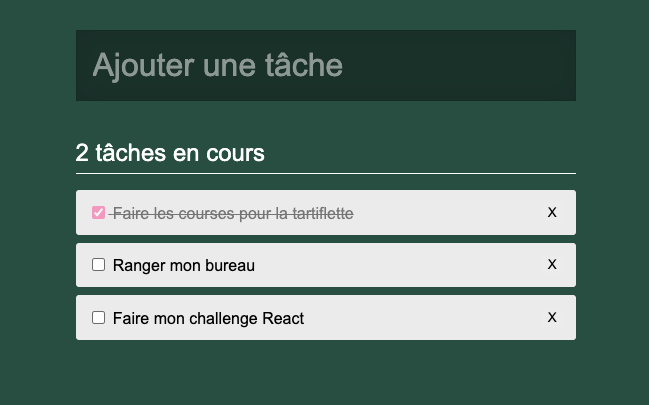

# CRUD Todolist en React

Créons une interface en React pour gérer une liste de tâches 💪

- Create : créer une nouvelle tache
- Read : voir la liste des taches
- Update : mettre à jour la valeur `done` d'une tache
- Delete : supprimer une tache

## Mise en place

- Un dossier `/inte` contient un exemple de structure html et de css correspondant au résultat ci-dessus
- On va reproduire la même structure mais en javascript à l'aide de React pour pouvoir ensuite intéragir facilement

  - Créé la structure de composants React en modularisant au maximum
  - Gére le style en récupérant celui fournit dans l'inté
  - Place les props

## API back

Notre collègue de l'équipe back nous a développé une petite API en Node, pour la lancer il suffit de se placer dans le dossier `api` et de lancer la commande `yarn` puis `yarn start`.

L'API sera dispo sur l'adresse `http://localhost:3000/`

Il y a 4 endpoints qui correspondent au CRUD des taches :

- GET `/tasks`
- POST `/tasks`
- PUT `/tasks/:task_id`
- DELETE `/tasks/:task_id`

### GET `/tasks` -> READ

- Recupère les taches depuis l'API et stocke les dans le `state` de App
- Calcule le compteur de tâches non-effectuées à partir des données du `state`
- Dynamise tout l'affichage avec les données du `state` ou les données calculées depuis les données du `state`

### POST `/tasks` -> CREATE

- Créé un composant contrôlé pour le input texte
- A la soumission du formulaire, ajoute une nouvelle tâche en envoyant le contenu de l'input au back
- Maintien le `state` à jour en ajoutant également cette nouvelle tache dedans.

### DELETE `/tasks/:task_id` -> DELETE

- Au click sur le bouton `X` envoie la requette de suppression au back
- Maintient le `state` à jour avec la liste que te renvoie le back

### PUT `/tasks/:task_id` -> UPDATE

- Créé un composant controlé pour les checkbox
- AU changement de valeur d'une checkbox envoie le changement au back
- Maintient le `state` à jour avec la liste que te renvoie le back
- Bonus : gère aussi la modif de label

## idées de BONUS

- Ordonner les tâches

  - En haut, les tâches non effectuées
  - Ensuite, les tâches effectuées

- Au premier rendu, place le focus dans l'input de saisie du label du'une nouvelle tache

- Ajouter un dark mode, il doit rester activé si on recharge la page
  -> si on rechage la page le state est perdu mais tu peux sauvegarder le theme en localStorage 😉
